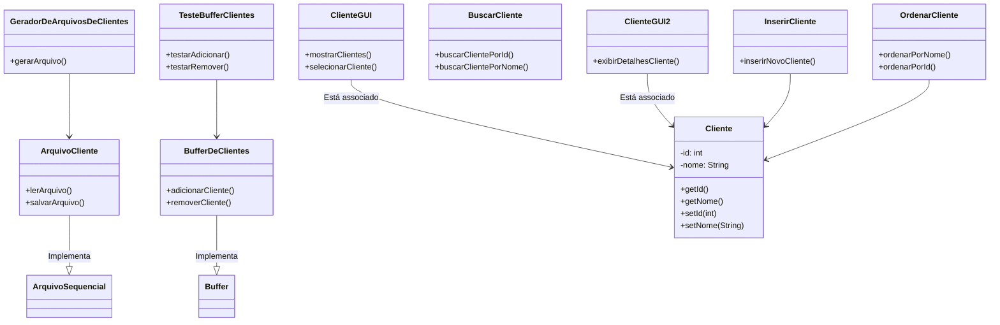

# Trabalho Prático 2 - Sistema de Gerenciamento de models.Cliente

* **Autores:** Manoel Rodrigues Loureiro e Sofia de Alcantara Silva
* **Disciplina:** Técnicas de Programação Avançada  
* **Professor:** Mateus Conrad B. da Costa
* **Curso:** Bacharelado em Sistemas de Informação 
* Instituto Federal do Espírito Santo  

---

## Sumário
1. [Equipe](#equipe)
2. [Descrição do Problema](#descrição-do-problema)
3. [Arquitetura da Aplicação com Diagrama de Classes](#arquitetura-da-aplicação-com-diagrama-de-classes)
   1. [Diagrama de Classes](#diagrama-de-classes)
   2. [Descrição da Arquitetura](#descrição-da-arquitetura)
6. [Descrição dos Principais Algoritmos Utilizados](#descrição-dos-principais-algoritmos-utilizados)
7.    1. [Algoritmo 1 - [Nome do Algoritmo]](#algoritmo-1---nome-do-algoritmo)
8.    2. [Algoritmo 2 - [Nome do Algoritmo]](#algoritmo-2---nome-do-algoritmo)
9. [Operações Realizadas](#operações-realizadas)
10. [Instruções de Execução](#instruções-de-execução)
11. [Link para o Código-Fonte](#link-para-o-código-fonte)
12. [Conclusão](#conclusão)

---
### Equipe

- Manoel Rodrigues Loureiro
- Sofia de Alcantara Silva

## Descrição do Problema

### Contextualização

O problema que este trabalho busca resolver é a **gestão eficiente de grandes volumes de dados** relacionados aos clientes de uma empresa fictícia. Em um cenário onde a empresa possui mil, milhares ou milhões de clientes cadastrados, a necessidade de armazenar, processar e acessar rapidamente essas informações se torna um desafio. 

Assim, como os dados são armazenados, manipulados e acessados é crucial para garantir que o sistema seja escalável e eficiente, principalmente quando se trata de grandes arquivos de clientes, que não podem ser completamente carregados na memória devido à limitação de recursos.

### Objetivo do Trabalho

O objetivo deste trabalho é implementar um sistema de gerenciamento de clientes que possibilite realizar as operações básicas de forma eficiente, mesmo com grandes volumes de dados. O sistema deverá ser capaz de:

- **Listar clientes em ordem alfabética:** Usando um algoritmo de ordenação externa, o sistema deve ordenar os dados dos clientes de maneira eficiente e exibi-los ao usuário.

- **Pesquisar clientes:** O sistema deve permitir a pesquisa rápida de clientes com base em nomes ou sobrenomes.

- **Inserir novos clientes:** O sistema deve ser capaz de adicionar novos clientes à base de dados, garantindo que a ordem dos registros seja mantida conforme a ordenação.

- **Remover clientes:** O sistema deve permitir a remoção de registros de clientes de maneira eficiente, ajustando os dados conforme necessário.

A implementação incluirá uma interface gráfica baseada em JFrame, que proporcionará ao usuário uma maneira intuitiva de interagir com o sistema. A interface gráfica também será otimizada para carregar registros de clientes em lotes, minimizando o uso de memória durante a exibição dos dados.

---

## Arquitetura da Aplicação com Diagrama de Classes


_Figura 1: Este diagrama mostra as principais classes envolvidas no sistema e seus relacionamentos._

### Descrição da Arquitetura

[Explique a arquitetura geral do sistema, como os componentes interagem entre si e a finalidade de cada classe ou módulo importante. A arquitetura pode ser dividida em camadas, como: Interface do Usuário, Lógica de Negócio, Acesso a Dados, etc.]

---

## Descrição dos Principais Algoritmos Utilizados

### Algoritmo 1 - [Nome do Algoritmo]

[Descreva o algoritmo utilizado, seu funcionamento, e onde ele é aplicado dentro da solução. Se for necessário, inclua um pseudocódigo ou código.]

```python
# Exemplo de pseudocódigo ou trecho do código
def algoritmo_exemplo():
    pass
```

## Operações Realizadas

A seguir, são apresentadas imagens das telas da aplicação, que demonstram as operações realizadas e como o usuário interage com o sistema.

### Tela/Operação 1:
Descrição: [Breve descrição da tela e o que ela representa no contexto do trabalho.]

### Tela/Operação 2:
Descrição: [Breve descrição da tela e o que ela representa no contexto do trabalho.]

---
## Pré-requisitos
Certifique-se de ter instalado as seguintes ferramentas:
- **Java Development Kit (JDK)** versão 8 ou superior. Você pode baixar a versão mais recente do JDK do [site oficial da Oracle](https://www.oracle.com/java/technologies/javase-jdk11-downloads.html).
- **Maven** (certifique-se de que o Maven foi adicionado ao PATH do seu sistema).

## **Compilação & Execução**


### **Testes e Uso**
[Dê exemplos de como o usuário pode testar a aplicação ou utilizar funcionalidades específicas.]

## Link para o Código-Fonte
O código-fonte completo da aplicação pode ser acessado no seguinte link:

🔗 https://github.com/sofialctv/gestao-de-clientes

---
## Conclusão
[Uma breve conclusão sobre os resultados do trabalho, dificuldades enfrentadas e possíveis melhorias ou evoluções para o futuro.]