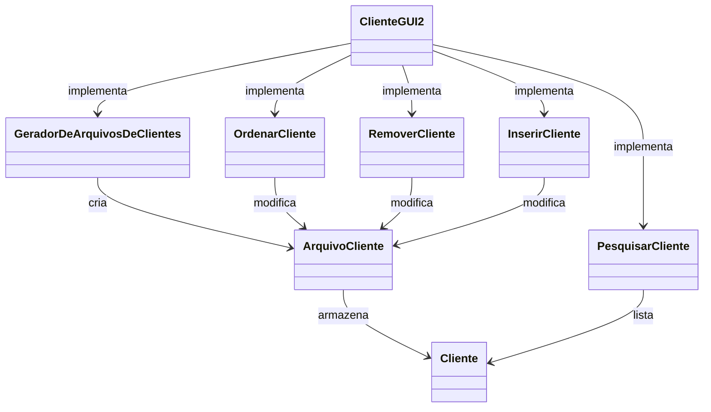

# Trabalho Prático 2 - Sistema de Gerenciamento de Cliente

_Disciplina de **Técnicas de Programação Avançada**, ministrada pelo Professor [Mateus Conrad B. da Costa](https://github.com/mbarcosta) no curso de Bacharelado em Sistemas de Informação do Instituto Federal do Espírito Santo_.

---

### Equipe

- Manoel Rodrigues Loureiro - [@ManoelRL](https://github.com/ManoelRL)
- Sofia de Alcantara Silva - [@sofialctv](https://sofialctv)

## Descrição do Problema

### Contextualização

O problema que este trabalho busca resolver é a **gestão eficiente de grandes volumes de dados** relacionados aos clientes de uma empresa fictícia. Em um cenário onde a empresa possui mil, milhares ou milhões de clientes cadastrados, a necessidade de armazenar, processar e acessar rapidamente essas informações se torna um desafio.

Assim, como os dados são armazenados, manipulados e acessados é crucial para garantir que o sistema seja escalável e eficiente, principalmente quando se trata de grandes arquivos de clientes, que não podem ser completamente carregados na memória devido à limitação de recursos.

### Objetivo do Trabalho

O objetivo deste trabalho é implementar um sistema de gerenciamento de clientes que possibilite realizar as operações básicas de forma eficiente, mesmo com grandes volumes de dados. O sistema deverá ser capaz de:

- **Listar clientes em ordem alfabética:** Usando um algoritmo de ordenação externa, o sistema deve ordenar os dados dos clientes de maneira eficiente e exibi-los ao usuário.

- **Pesquisar clientes:** O sistema deve permitir a pesquisa rápida de clientes com base em nomes ou sobrenomes.

- **Inserir novos clientes:** O sistema deve ser capaz de adicionar novos clientes à base de dados, garantindo que a ordem dos registros seja mantida conforme a ordenação.

- **Remover clientes:** O sistema deve permitir a remoção de registros de clientes de maneira eficiente, ajustando os dados conforme necessário.

A implementação incluirá uma interface gráfica baseada em JFrame, que proporcionará ao usuário uma maneira intuitiva de interagir com o sistema. A interface gráfica também será otimizada para carregar registros de clientes em lotes, minimizando o uso de memória durante a exibição dos dados.

---

## Arquitetura da Aplicação com Diagrama de Classes



### Descrição da Arquitetura
A arquitetura do sistema pode ser dividida em quatro camadas principais, com cada um desempenhando um papel específico:

#### Camada de Interfaces (Interfaces)
* **ArquivoSequencial:** Esta classe define uma interface para o gerenciamento de arquivos sequenciais, permitindo a leitura e gravação dos dados.

* **Buffer:** Define uma interface que gerencia o buffer de dados dos clientes, proporcionando uma abstração para manipulação de dados temporários.

##### Camada de Modelos (Models)

* **ArquivoCliente:** Representa os arquivos que armazenam os dados dos clientes, sendo responsável pela leitura e escrita desses dados no sistema de arquivos.

* **BufferDeClientes:** Esta classe implementa o buffer de dados, armazenando e fornecendo os registros dos clientes para o sistema.

* **Cliente:** Modelo que representa os dados de um cliente, incluindo informações como nome, telefone, endereço, e outros atributos associados ao cliente.

#### Camada de Utilitários (Utils):

* **GeradorDeArquivosDeClientes:** Responsável pela criação de arquivos de clientes fictícios, gerando dados em larga escala para testar ou popular o sistema com informações de clientes.

* **OrdenarCliente:** Fornece a funcionalidade para ordenar os dados dos clientes, permitindo a organização dos registros em ordem alfabética.

##### Camada de Visualização (Views):

* **ClienteGUI2:** Interface gráfica principal do sistema, permitindo que o usuário interaja com a aplicação para gerenciar, visualizar e modificar os dados dos clientes.

* **InserirCliente:** Interface para inserção de novos clientes no sistema.

* **PesquisarCliente:** Interface que permite ao usuário pesquisar clientes existentes dentro do sistema.

* **RemoverCliente:** Interface para remover clientes do sistema, com ações associadas à manipulação dos dados.

---

## Descrição dos Principais Algoritmos Utilizados

### External Merge Sort (Ordenação Externa)

O algoritmo de ordenação utilizado na classe OrdenarCliente é baseado no External Merge Sort (ou Ordenação Externa). Esse algoritmo é adequado para ordenar grandes volumes de dados que não cabem na memória principal (RAM). A ordenação é realizada em duas etapas principais: divisão dos dados em partes menores (chunks) que cabem na memória e, em seguida, a mesclagem dessas partes já ordenadas para produzir um único arquivo final ordenado.

#### Etapa 1: Divisão dos Dados em Partes Ordenadas (Chunks)
Na primeira fase, o algoritmo lê partes dos dados do arquivo de entrada, organiza essas partes (chunks) na memória e, em seguida, grava esses chunks já ordenados em arquivos temporários.

* **Leitura do arquivo original:** O arquivo contendo os objetos Cliente é lido em blocos de tamanho fixo, determinado pela constante CHUNK_SIZE.

* **Ordenação de cada chunk:** Cada bloco é ordenado em memória usando o método Collections.sort(), que usa o algoritmo de QuickSort ou Timsort, dependendo da implementação da JVM.

* **Gravação dos chunks ordenados:** Após a ordenação, o bloco é gravado em um arquivo temporário.**

```commandline
// Exemplo de pseudocódigo

Enquanto não houver mais dados:
   Ler um bloco de dados (tamanho CHUNK_SIZE)
   Ordenar o bloco na memória
   Gravar o bloco ordenado em um arquivo temporário
Repetir até que todos os dados sejam lidos
```

#### Etapa 2: Mesclagem dos Chunks Ordenados
Após criar todos os arquivos temporários, o algoritmo realiza a mesclagem desses arquivos para criar o arquivo final ordenado. A mesclagem é feita utilizando uma fila de prioridade (PriorityQueue), que mantém os primeiros elementos de cada chunk temporário. A fila sempre mantém o menor elemento no topo, permitindo que os menores registros sejam escritos no arquivo final em ordem crescente.

* **Abrir streams dos arquivos temporários:** Para cada arquivo temporário gerado na etapa anterior, um ObjectInputStream é aberto para leitura sequencial.

* **Fila de prioridade:** A fila de prioridade é utilizada para armazenar o primeiro elemento de cada chunk. A cada iteração, o menor elemento da fila é removido e gravado no arquivo de saída, enquanto o próximo elemento do chunk correspondente é adicionado à fila.

* **Mesclagem final:** O processo continua até que todos os chunks tenham sido totalmente mesclados e o arquivo final seja completo.

````commandline
// Exemplo de pseudocódigo

Criar uma fila de prioridade (PriorityQueue)

Para cada arquivo temporário:
    Ler o primeiro elemento e adicioná-lo à fila de prioridade

Enquanto a fila de prioridade não estiver vazia:
    Remover o menor elemento da fila
    Gravar o elemento no arquivo final ordenado
    Ler o próximo elemento do arquivo temporário correspondente e adicioná-lo à fila
````
### Estrutura da Fila de Prioridade

A fila de prioridade (PriorityQueue<ClienteEntry>) mantém um objeto ClienteEntry, que contém o cliente e o índice do arquivo temporário de onde ele foi lido. A comparação entre os clientes é feita com base na implementação do método compareTo() na classe Cliente, permitindo a ordenação por atributos como o nome ou qualquer outro critério definido.

### Complexidade do Algoritmo:
* **Fase de criação dos chunks:** O custo de leitura e gravação dos chunks é proporcional ao número de elementos no arquivo original, ou seja, `O(N)`. A ordenação de cada chunk tem complexidade `O(M log M)`, onde M é o tamanho do chunk, geralmente limitado pela quantidade de memória disponível.

* **Fase de mesclagem:** A mesclagem dos arquivos temporários usa uma fila de prioridade, que opera em O(log K) para cada inserção e remoção, onde K é o número de chunks. Para N elementos, a complexidade total da mesclagem é `O(N log K)`.

---
## Pré-requisitos
Certifique-se de ter instalado as seguintes ferramentas:
- **Java Development Kit (JDK)** versão 8 ou superior. Você pode baixar a versão mais recente do JDK do [site oficial da Oracle](https://www.oracle.com/java/technologies/javase-jdk11-downloads.html).
- **Maven** (certifique-se de que o Maven foi adicionado ao PATH do seu sistema).

## **Passos para Compilação & Execução**

1. Clone o repositório do GitHub para sua máquina local utilizando o comando:
`git clone https://github.com/seu-usuario/nome-do-repositorio.git`

2. Navegue até o diretório do projeto e compile-o utilizando o comando: 
`mvn clean compile`

3. Execute o arquivo `ClienteGUI2.java`.

## Link para o Código-Fonte
O código-fonte completo da aplicação pode ser acessado em https://github.com/sofialctv/gestao-de-clientes

---